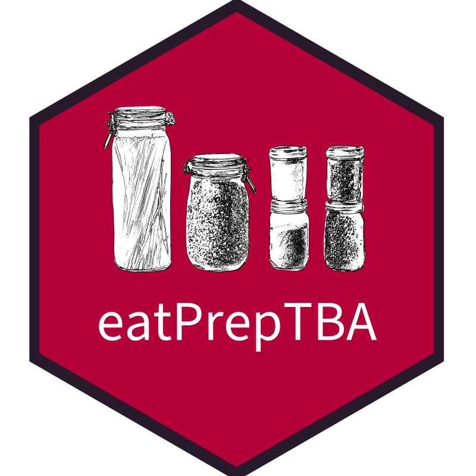

<!-- README.md is generated from README.Rmd. Please edit that file -->

```{r, include = FALSE}
knitr::opts_chunk$set(
  collapse = TRUE,
  comment = "#>",
  out.width = "100%"
)
```

# eatPrepTBA <a href="https://iqb-research.github.io/eatPrepTBA/"></a>

<!-- badges: start -->
[](https://lifecycle.r-lib.org/articles/stages.html#experimental)
[](https://github.com/iqb-research/eatPrepTBA/actions/workflows/R-CMD-check.yaml)
[](https://app.codecov.io/gh/iqb-research/eatPrepTBA?branch=main)
<!-- badges: end -->

The goal of eatPrepTBA is to provide wrapper functions to interact with the IQB Studio and the IQB Testcenter APIs. Moreover, it provides some routines for preparing and blending data from these different resources to manage TBA studies.

## Package governance

This package was originally authored and created by Philipp Franikowski. **Current package maintenance** is provided by Karoline A. Sachse, Kristoph Schumann, and Jakob Schaefer.


## Installation

You can install the development version of eatPrepTBA from [GitHub](https://github.com/) with:

``` r
install.packages("pak") # once
pak::pak("iqb-research/eatPrepTBA")
```

## Getting started

Start with the [Studio introduction](https://iqb-research.github.io/eatPrepTBA/articles/eatPrepTBA.html)
to connect to a workspace and retrieve units. For response coding, missing values,
and a scaling data set, see the [standard workflow](https://iqb-research.github.io/eatPrepTBA/articles/standard-workflow.html) (in German).
