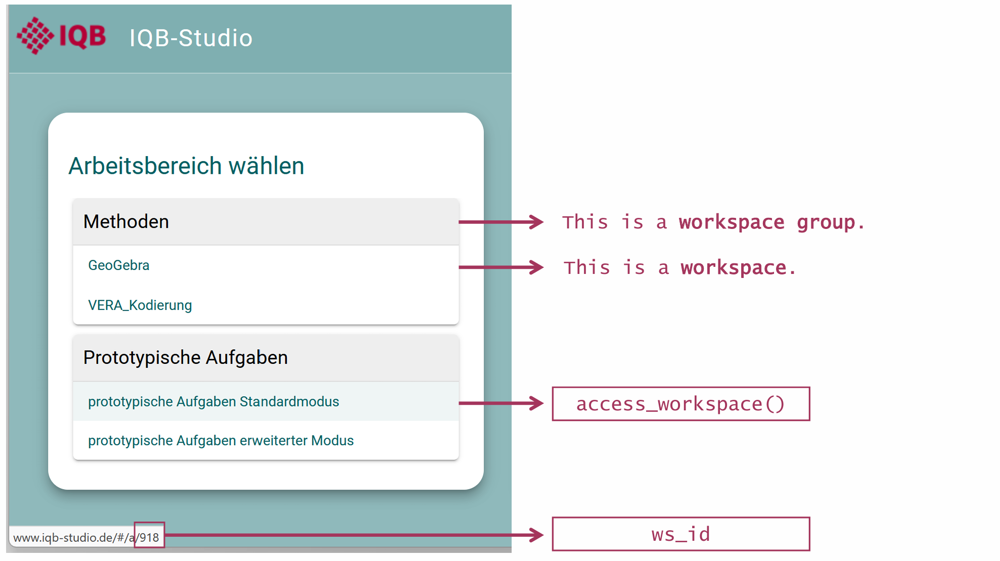
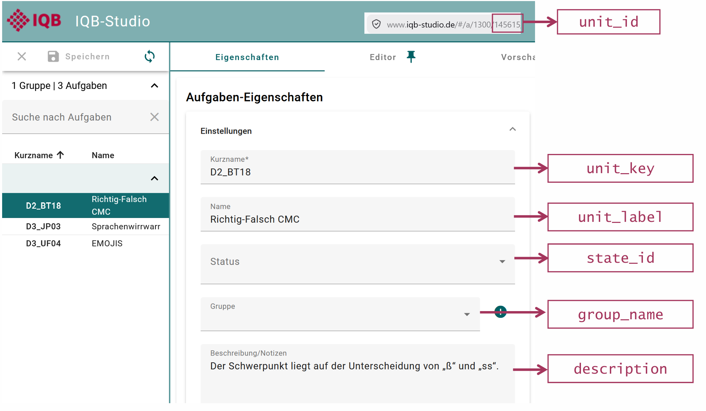
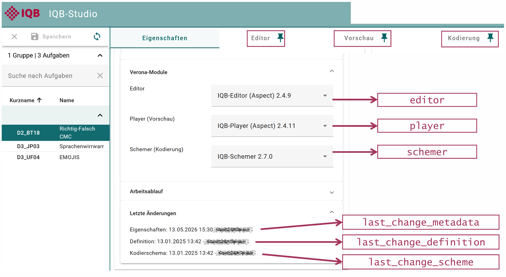
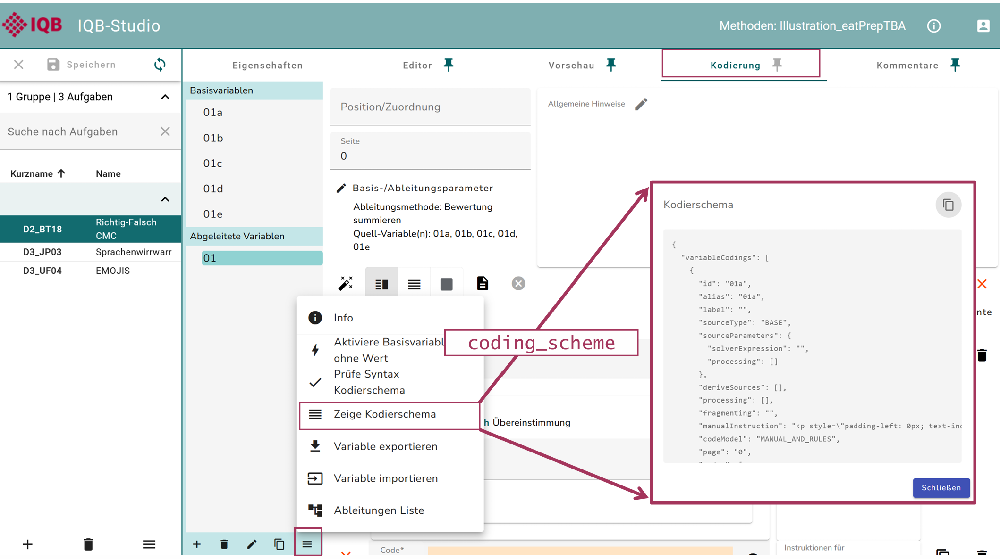

# Introduction to the IQB-Studio with eatPrepTBA

`eatPrepTBA` is an R package designed to support the preparation and
management of technology-based assessments (TBA) used in IQB research
workflows. It provides wrapper functions to interact with the IQB Studio
and the IQB Testcenter APIs. Moreover, it provides some routines for
preparing and combining data from these different resources to manage
TBA studies.

This introduction covers Studio access and unit metadata. For response
coding, missing values, and a scaling data set, continue with the
[standard
workflow](https://iqb-research.github.io/eatPrepTBA/articles/standard-workflow.md)
(in German).

## Preparations

`eatPrepTBA` can be installed from
[GitHub](https://github.com/iqb-research/eatPrepTBA).

``` r

install.packages("pak") # once
pak::pak("iqb-research/eatPrepTBA")
library(eatPrepTBA)
```

## IQB-Studio Login

To log in to the IQB Studio, use
[`login_studio()`](https://iqb-research.github.io/eatPrepTBA/reference/login_studio.md).
Replace `STUDIO_VERSION` with the version shown by your Studio instance
(marked as `app_version` in the screenshot below, for example at
<https://www.iqb-studio.de>). Workspace IDs below are examples; replace
them with IDs available to your account. The Studio version is not
detected automatically; set it explicitly rather than relying on the
package’s older default.

``` r

app_version <- "STUDIO_VERSION"
login <- login_studio(keyring = TRUE, app_version = app_version)
```

By default, credentials are entered in a dialog with masked password
input, also outside RStudio when a GUI is available. If no dialog is
available, or with `dialog = FALSE`, the function uses console input.
The screenshots show an earlier Studio version; the interface may look
different.


With `keyring = TRUE`, credentials are stored in your local credential
store and reused on later calls. Each call still logs in to Studio, but
you do not need to type the credentials again. Use `change_key = TRUE`
together with `keyring = TRUE` to replace saved credentials.

The function returns a `LoginStudio` object invisibly. It contains the
workspace information and a request function that uses the access token
for later API calls. Save it as `login` and pass it to
[`access_workspace()`](https://iqb-research.github.io/eatPrepTBA/reference/access_workspace.md).
Printing `login` shows the workspace groups and workspaces available to
your account.

## Accessing a workspace

All workspaces are part of a workspace group and have a unique ID.

You can access a workspace with
[`access_workspace()`](https://iqb-research.github.io/eatPrepTBA/reference/access_workspace.md).
The argument `ws_id` selects the workspace.

``` r

workspace <- access_workspace(login = login, ws_id = 1300)
```

The ID of a workspace can be found by looking at its URL in the Studio
(last digits) or by calling the `login` object, which prints a list of
the workspace groups and workspaces that you have access to, including
their respective IDs (`ws_id`).



You should save your output into an object (e.g., “workspace”) to be
able to work with it later.

You can also access multiple workspaces at the same time:

``` r

workspace <- access_workspace(login = login, ws_id = c(1300, 919))
```

## Accessing the units in a workspace

Using the `workspace` object, retrieve units with
[`get_units()`](https://iqb-research.github.io/eatPrepTBA/reference/get_units.md).
This loads the units from the selected workspaces into one table; larger
workspaces may take a moment to load. Metadata is included by default.
Use `unit_definition = TRUE` if you also need page information.

``` r

units <- get_units(workspace = workspace)
```

The output below uses three anonymized example units with 37 variables
from a saved Studio export. It is an illustration, not a live download.

[`get_units()`](https://iqb-research.github.io/eatPrepTBA/reference/get_units.md)
returns a tibble with one row per unit and several metadata columns,
including nested list-columns.

``` r

units
```

    ## # A tibble: 3 × 27
    ##   ws_label         wsg_id wsg_label unit_id unit_key unit_label group_name ws_id
    ##   <chr>             <int> <chr>       <int> <chr>    <chr>      <chr>      <dbl>
    ## 1 Illustration_ea…     46 Methoden   145615 D2_BT18  Richtig-F… ""          1300
    ## 2 Illustration_ea…     46 Methoden   145616 D3_UF04  EMOJIS     ""          1300
    ## 3 Illustration_ea…     46 Methoden   145617 D3_JP03  Sprachenw… ""          1300
    ## # ℹ 19 more variables: state_id <chr>, state_color <chr>, state_label <chr>,
    ## #   description <chr>, unit_variables <list>, unit_profiles <list>,
    ## #   items_list <list>, items_profiles <list>, coding_scheme <chr>,
    ## #   player <chr>, editor <chr>, schemer <chr>, scheme_type <chr>,
    ## #   last_change_definition <chr>, last_change_definition_user <chr>,
    ## #   last_change_scheme <chr>, last_change_scheme_user <chr>,
    ## #   last_change_metadata <chr>, last_change_metadata_user <chr>

The tibble contains the following variables:

``` r

names(units)
```

    ##  [1] "ws_label"                    "wsg_id"                     
    ##  [3] "wsg_label"                   "unit_id"                    
    ##  [5] "unit_key"                    "unit_label"                 
    ##  [7] "group_name"                  "ws_id"                      
    ##  [9] "state_id"                    "state_color"                
    ## [11] "state_label"                 "description"                
    ## [13] "unit_variables"              "unit_profiles"              
    ## [15] "items_list"                  "items_profiles"             
    ## [17] "coding_scheme"               "player"                     
    ## [19] "editor"                      "schemer"                    
    ## [21] "scheme_type"                 "last_change_definition"     
    ## [23] "last_change_definition_user" "last_change_scheme"         
    ## [25] "last_change_scheme_user"     "last_change_metadata"       
    ## [27] "last_change_metadata_user"

Four of these variables are already familiar from the workspace
information:

- `ws_id`: the ID of the respective workspace
- `ws_label`: the name of the respective workspace
- `wsg_id`: the ID of the workspace group of the respective workspace
- `wsg_label`: the name of the workspace group of the respective
  workspace

Like workspaces, each unit has its own unique ID and label. Each unit
also has a unit key and sometimes a description and information about
its state.

- `unit_id`: the unique ID of the unit.
- `unit_label`: the label (name) of the unit.
- `unit_key`: the short name of the unit.
- `group_name`: the group assigned to the unit.
- `description`: the description or notes stored for the unit.
- `state_id`: the state identifier supplied by Studio. Its meaning
  depends on the workspace-group settings; `state_label` and
  `state_color` are added when those settings are available.




In the Studio, the tab “Verona Module” shows information about the
software component behind a unit’s editor, preview, or coding interface.

- `editor`: the editor module assigned to the unit
- `player`: the preview/runtime module assigned to the unit
- `schemer`: the coding module assigned to the unit

To check for updates and changes via the Editor, you can have a look at
the variables starting with `last_change`.

- `last_change_definition`: timestamp of the last change to the unit
  definition.
- `last_change_definition_user`: user who last changed the unit
  definition.
- `last_change_scheme`: timestamp of the last change to the coding
  scheme.
- `last_change_scheme_user`: user who last changed the coding scheme.
- `last_change_metadata`: timestamp of the last change to the metadata.
- `last_change_metadata_user`: user who last changed the metadata.



The coding scheme of a unit defines how responses in a unit are
interpreted or scored.
[`get_units()`](https://iqb-research.github.io/eatPrepTBA/reference/get_units.md)
returns it in JSON format. In the Studio, it is not possible to check
for mistakes in the coding scheme across several units. With eatPrepTBA,
you can check several units at once.

- `coding_scheme`: the coding scheme of the respective unit in JSON
  format.



The variables `unit_variables`, `unit_profiles`, `items_list`, and
`items_profiles` are list-columns containing nested information rather
than single values.

- `unit_variables`: the input variables supplied by the unit. A coding
  scheme can derive an item score from several input variables, for
  example by summing several true/false responses. The item-variable
  links are stored in `items_list`;
  [`add_item_id()`](https://iqb-research.github.io/eatPrepTBA/reference/add_item_id.md)
  attaches these item IDs to variable-level data.

For a closer look at the variables inside the unit, the lists can be
unnested:

``` r

# undo nested structure
units_unnested <- units |>
  dplyr::select(unit_key, unit_variables) |>
  tidyr::unnest(unit_variables)
```

``` r

units_unnested
```

    ## # A tibble: 37 × 11
    ##    unit_key variable_id variable_ref variable_page variable_type variable_format
    ##    <chr>    <chr>       <chr>        <chr>         <chr>         <chr>          
    ##  1 D2_BT18  01a         01a          ""            integer       ""             
    ##  2 D2_BT18  01b         01b          ""            integer       ""             
    ##  3 D2_BT18  01c         01c          ""            integer       ""             
    ##  4 D2_BT18  01d         01d          ""            integer       ""             
    ##  5 D2_BT18  01e         01e          ""            integer       ""             
    ##  6 D3_UF04  12          12           ""            string        "text-selectio…
    ##  7 D3_UF04  01          01           ""            integer       ""             
    ##  8 D3_UF04  02          02           ""            integer       ""             
    ##  9 D3_UF04  03          03           ""            integer       ""             
    ## 10 D3_UF04  04          04           ""            integer       ""             
    ## # ℹ 27 more rows
    ## # ℹ 5 more variables: variable_values <list>, variable_multiple <lgl>,
    ## #   variable_nullable <lgl>, variable_values_complete <lgl>,
    ## #   variable_value_position_labels <list>
