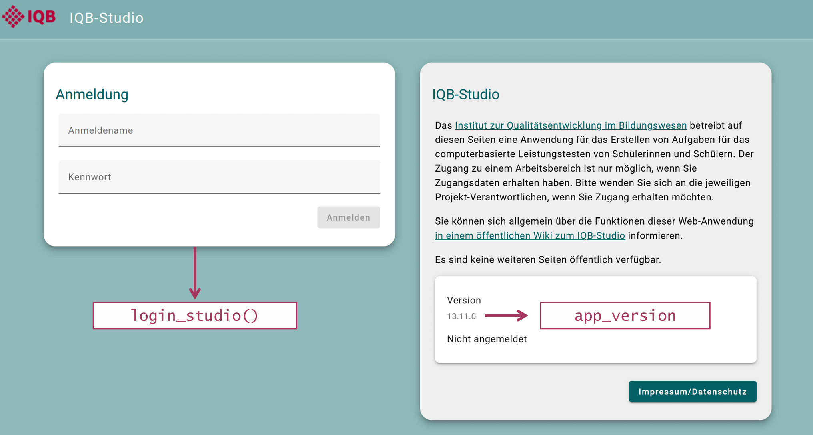
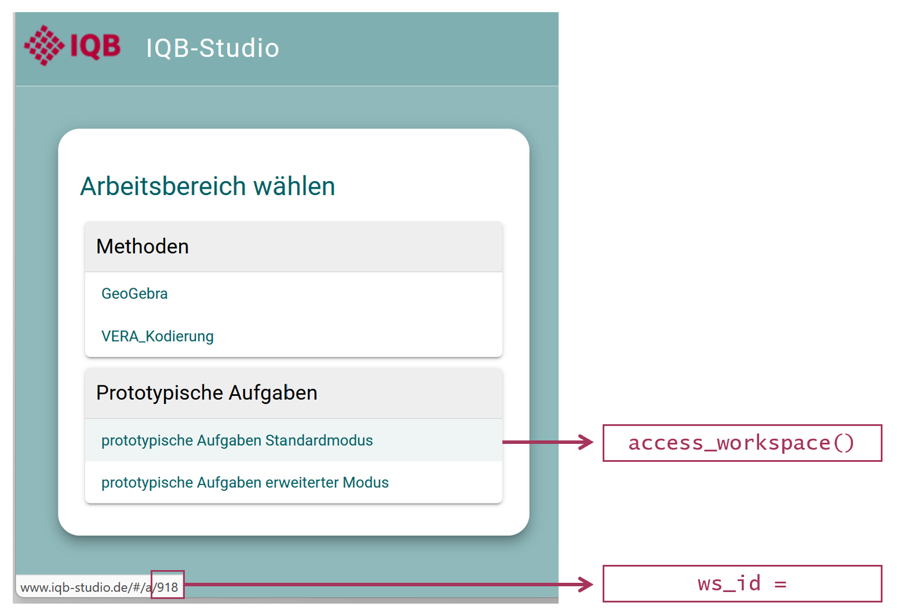

`eatPrepTBA` is an R package designed to support the preparation and management of technology-based assessments (TBA) used in IQB research workflows. It provides wrapper functions to interact with the IQB Studio and the IQB Testcenter APIs. Moreover, it provides some routines for preparing and blending data from these different resources to manage TBA studies.

```{r, include = FALSE}
# originalTestMode <- getOption("eatPrepTBA.test_mode")
# options("eatPrepTBA.test_mode" = TRUE)
# 
# knitr::opts_chunk$set(
#   collapse = TRUE, 
#   comment = "#>"
# )
```

## Preparations

`eatPrepTBA` can be installed from [GitHub](https://github.com/iqb-research/eatPrepTBA).

```{r setup, eval=FALSE}
install.packages("devtools")
devtools::install_github("iqb-research/eatPrepTBA")
library(eatPrepTBA)
```


## IQB-Studio Login

To log in to the IQB Studio, you can call the function `login_studio()`.

```{r, eval=FALSE}
login <- login_studio(keyring = TRUE, app_version = "16.0.0", change_key = TRUE)
```

You will be asked to provide your username and password either in the console or in a dialogue (when using RStudio). This is equivalent to logging into the Studio by entering your username and password on https://www.iqb-studio.de.

The current `app_version` needs to be updated manually and can be found [here](https://www.iqb-studio.de).

```{r, out.width="100%", echo = FALSE}

```

If you use the argument `keyring = TRUE`, your login data will be saved locally to your computer, so that you don't have to login every time you call `login_studio()`. If you want to change your login information (e.g. after accidentally entering the wrong password), you can add the argument `change_key = TRUE` to the `login_studio()`-function. This will call the dialogue for entering your login information again.

The function itself invisibly provides an access token, i.e., something like a key to all of your studies. This can be used on other function calls to retrieve data from the IQB-Studio. To use this key in other functions, it should be assigned to an `R` object, e.g., `login`. Calling the `login` object returns a list of workspaces that can be accessed with your credentials.


## Accessing a workspace

All workspaces are part of a workspace group and have a unique ID.

You can access a workspace with the function `access_workspace()`. With the argument `ws_id = x`, you choose which workspace to access. 

```{r, eval=FALSE}
workspace <- access_workspace(login = login, ws_id = 918)
```

The ID of a workspace can be found by looking at its URL in the Studio (last digits) or by calling the `login` object, which prints a list of the workspace groups and workspaces that you have access to, including their respective IDs (`ws_id`). 

```{r, out.width="100%", echo = FALSE}

```

You should save your output into an object (e.g., "workspace") to be able to work with it later. 

You can also access multiple workspaces at the same time:

```{r, eval=FALSE}
workspace <- access_workspace(login = login, ws_id = c(918, 919))
```


## Accessing the units in a workspace

From the `workspace` object, you can now extract the units using the `get_units()` function. This function allows you to look at many units at once, instead of having to go through them one by one like in the Studio. Depending on how many workspaces you access, this might take a moment to load.

```{r, eval = FALSE}
units <- get_units(workspace = workspace)
```

```{r eval = FALSE, echo = FALSE}
# This is used once for the creation of an example unit tibble...
units %>% readr::write_rds("inst/extdata/example_units.rds")
```

```{r echo = FALSE}
# ...that can be used in the vignette without needing to log into the Studio
units <- readr::read_rds(system.file("extdata", "example_units.rds", package = "eatPrepTBA"))
```

`get_units()` returns a tibble with one row per unit and several metadata columns, including nested list-columns.

```{r}
units
```

The tibble contains the following variables:

```{r}
names(units)
```

Four of these variables are already familiar from the workspace information:

- `ws_id`: the ID of the respective workspace
- `ws_label`: the name of the respective workspace
- `wsg_id`: the ID of the workspace group of the respective workspace
- `wsg_label`: the name of the workspace group of the respective workspace

Like workspaces, each unit has its own unique ID and label. Each unit also has a unit key and sometimes a description and information about its state.

- `unit_id`: the unique ID of the unit.
- `unit_label`: the label (name) of the unit.
- `unit_key`: the short name of the unit.
- `group_name`: the group assigned to the unit.
- `description`: the description or notes stored for the unit.
- `state_id`: If no state is set, this variable is 0. The package can also attach the corresponding `state_label` (e.g. `state_id = 1`  means “zu klären”) and `state_color` when those settings exist.

In the Studio, the tab "Verona Module" shows information about the software component behind a unit’s editor, preview, or coding interface.

- `editor`: the editor module assigned to the unit
- `player`: the preview/runtime module assigned to the unit
- `schemer`: the coding module assigned to the unit

To check for updates and changes via the Editor, you can have a look at the variables starting with `last_change`. 

- `last_change_definition`: timestamp of the last change to the unit definition.
- `last_change_definition_user`: user who last changed the unit definition.
- `last_change_scheme`: timestamp of the last change to the coding scheme.
- `last_change_scheme_user`: user who last changed the coding scheme.
- `last_change_metadata`: timestamp of the last change to the metadata.
- `last_change_metadata_user`: user who last changed the metadata.

The coding scheme of a unit defines how responses in a unit are interpreted or scored. `get_units()` returns it in JSON format. In the Studio, it is not possible to check for mistakes in the coding scheme across several units. With eatPrepTBA, you can check several units at once.

- `coding_scheme`: the coding scheme of the respective unit in JSON format.
- `scheme_type`: the type of coding scheme used for the unit.

The variables `unit_variables`, `unit_profiles`, `items_list`, and `items_profiles` are list-columns containing nested information rather than single values.

- `unit_variables`: which individual variables a unit contains. An item is sometimes derived only from multiple variables, for example by summing several true/false statements. Each row represents one variable (that is, one basic variable), but during coding a sum is calculated, and that sum becomes the item.

For a closer look at the variables inside the unit, the lists can be unnested.

```{r, eval = TRUE, message=FALSE, warning=FALSE}
library(tidyverse)
# undo nested structure
units_unnested <- units %>% 
  select(unit_key, unit_variables) %>% 
  unnest(unit_variables)
```

```{r}
units_unnested
```


