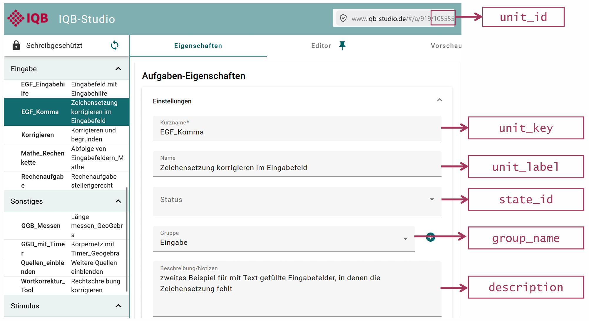
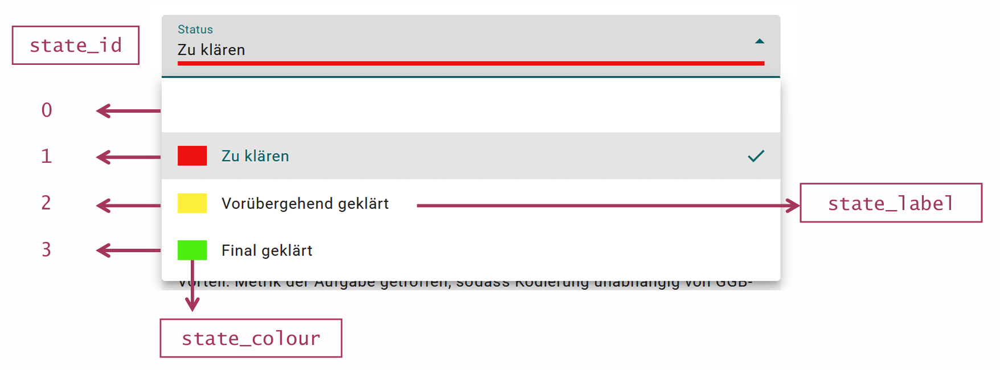
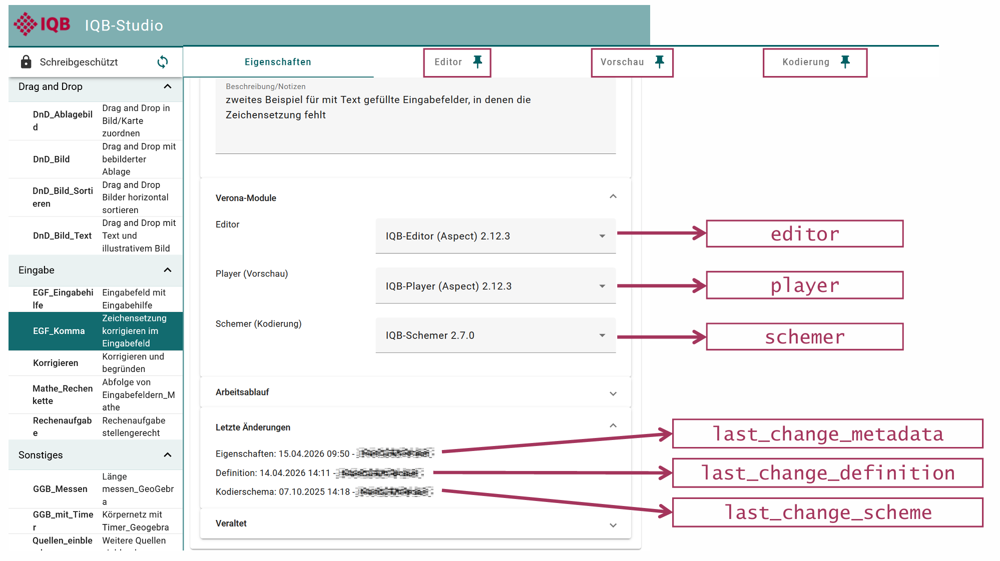
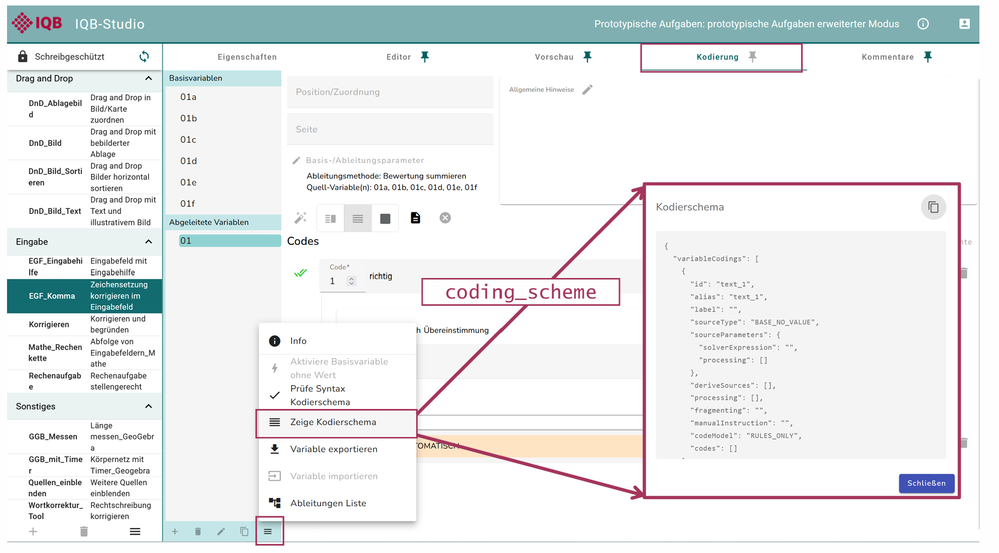

`eatPrepTBA` is an R package designed to support the preparation and management of technology-based assessments (TBA) used in IQB research workflows. It provides wrapper functions to interact with the IQB Studio and the IQB Testcenter APIs. Moreover, it provides some routines for preparing and combining data from these different resources to manage TBA studies.

```{r, include = FALSE}
# originalTestMode <- getOption("eatPrepTBA.test_mode")
# options("eatPrepTBA.test_mode" = TRUE)
# 
# knitr::opts_chunk$set(
#   collapse = TRUE, 
#   comment = "#>"
# )
```

## Preparations

`eatPrepTBA` can be installed from [GitHub](https://github.com/iqb-research/eatPrepTBA).

```{r setup, eval=FALSE}
install.packages("devtools")
devtools::install_github("iqb-research/eatPrepTBA")
library(eatPrepTBA)

install.packages("vctrs")
```


## IQB-Studio Login

To log in to the IQB Studio, you can call the function `login_studio()`.

```{r, eval=FALSE}
login <- login_studio(keyring = TRUE, app_version = "18.0.0")
```

You will be asked to provide your username and password either in the console or in a dialogue (when using RStudio). This is equivalent to logging into the Studio by entering your username and password on https://www.iqb-studio.de.

The current `app_version` needs to be updated manually and can be found [here](https://www.iqb-studio.de).

```{r, out.width="100%", echo = FALSE}
knitr::include_graphics("vignettes/images/Studio_Login.png")
```

If you use the argument `keyring = TRUE`, your login data will be saved locally to your computer, so that you don't have to log in every time you call `login_studio()`. If you want to change your login information (e.g. after accidentally entering the wrong password), you can add the argument `change_key = TRUE` to the `login_studio()`-function. This will call the dialogue for entering your login information again.

The function itself invisibly provides an access token, i.e., something like a key to all of your studies. This can be used on other function calls to retrieve data from the IQB-Studio. To use this key in other functions, it should be assigned to an `R` object, e.g., `login`. Calling the `login` object returns a list of workspaces that can be accessed with your credentials.


## Accessing a workspace

All workspaces are part of a workspace group and have a unique ID.

You can access a workspace with the function `access_workspace()`. With the argument `ws_id = x`, you choose which workspace to access.

```{r, eval=FALSE}
workspace <- access_workspace(login = login, ws_id = 1300)
```

The ID of a workspace can be found by looking at its URL in the Studio (last digits) or by calling the `login` object, which prints a list of the workspace groups and workspaces that you have access to, including their respective IDs (`ws_id`).

```{r, out.width="100%", echo = FALSE}
knitr::include_graphics("vignettes/images/Studio_Access_Workspace.png")
```

You should save your output into an object (e.g., "workspace") to be able to work with it later.

You can also access multiple workspaces at the same time:

```{r, eval=FALSE}
workspace <- access_workspace(login = login, ws_id = c(1300, 919))
```


## Accessing the units in a workspace

Using the `workspace` object, you can now extract the units using the `get_units()` function. This function allows you to look at many units at once, instead of having to go through them one by one like in the Studio. Depending on how many workspaces you access, this might take a moment to load.

```{r, eval = FALSE}
units <- get_units(workspace = workspace)
```

```{r eval = FALSE, echo = FALSE}
# Anonymize the output
units$last_change_definition_user <- "Max Mustermann"
units$last_change_scheme_user <- "Max Mustermann"
units$last_change_metadata_user <- "Max Mustermann"
# This is used once for the creation of an example unit tibble...
units %>% readr::write_rds("inst/extdata/example_units.rds")
```

```{r echo = FALSE}
# ...that can be used in the vignette without needing to log into the Studio
example_units <- system.file("extdata", "example_units.rds", package = "eatPrepTBA")
if (identical(example_units, "")) {
  example_units <- file.path("..", "inst", "extdata", "example_units.rds")
}
units <- readr::read_rds(example_units)
```

`get_units()` returns a tibble with one row per unit and several metadata columns, including nested list-columns.

```{r}
units
```

The tibble contains the following variables:

```{r}
names(units)
```

Four of these variables are already familiar from the workspace information:

- `ws_id`: the ID of the respective workspace
- `ws_label`: the name of the respective workspace
- `wsg_id`: the ID of the workspace group of the respective workspace
- `wsg_label`: the name of the workspace group of the respective workspace

Like workspaces, each unit has its own unique ID and label. Each unit also has a unit key and sometimes a description and information about its state.

- `unit_id`: the unique ID of the unit.
- `unit_label`: the label (name) of the unit.
- `unit_key`: the short name of the unit.
- `group_name`: the group assigned to the unit.
- `description`: the description or notes stored for the unit.
- `state_id`: If no state is set, this variable is 0. The package can also attach the corresponding `state_label` (e.g. `state_id = 1`  means “zu klären”) and `state_color` when those settings exist.

```{r, out.width="100%", echo = FALSE}

```

```{r, out.width="100%", echo = FALSE}

```

In the Studio, the tab "Verona Module" shows information about the software component behind a unit’s editor, preview, or coding interface.

- `editor`: the editor module assigned to the unit
- `player`: the preview/runtime module assigned to the unit
- `schemer`: the coding module assigned to the unit

To check for updates and changes via the Editor, you can have a look at the variables starting with `last_change`.

- `last_change_definition`: timestamp of the last change to the unit definition.
- `last_change_definition_user`: user who last changed the unit definition.
- `last_change_scheme`: timestamp of the last change to the coding scheme.
- `last_change_scheme_user`: user who last changed the coding scheme.
- `last_change_metadata`: timestamp of the last change to the metadata.
- `last_change_metadata_user`: user who last changed the metadata.

```{r, out.width="100%", echo = FALSE}

```

The coding scheme of a unit defines how responses in a unit are interpreted or scored. `get_units()` returns it in JSON format. In the Studio, it is not possible to check for mistakes in the coding scheme across several units. With eatPrepTBA, you can check several units at once.

- `coding_scheme`: the coding scheme of the respective unit in JSON format.

```{r, out.width="100%", echo = FALSE}

```

The variables `unit_variables`, `unit_profiles`, `items_list`, and `items_profiles` are list-columns containing nested information rather than single values.

- `unit_variables`: which individual variables a unit contains. An item is sometimes derived from multiple variables, for example by summing several true/false statements. Each row represents one variable (that is, one "Basisvariable"), but during coding a sum is calculated, and that sum becomes the item.

For a closer look at the variables inside the unit, the lists can be unnested:

```{r, eval = TRUE, message=FALSE, warning=FALSE}
# undo nested structure
units_unnested <- units |>
  dplyr::select(unit_key, unit_variables) |>
  tidyr::unnest(unit_variables)
```

```{r}
units_unnested
```

## Accessing a codebook of a workspace

A **codebook** provides a structured overview of the coding scheme of a workspace, including its units, variables, and corresponding codes. It can be accessed either directly in Studio or via `eatPrepTBA`.

### Accessing a codebook manually in IQB-Studio

To access the codebook manually in Studio, open the respective workspace and navigate to:
Berichte → Codebook

>  Screenshot "Access Studio1 und Studio 2" einfügen 

The content of the codebook can then be customized by selecting the relevant **units**, **variables**, **formatting options**, and **output format**.

Selecting **JSON** as the output format and clicking **Exportieren** creates a machine-readable version of the codebook.


### Codebook vs. coding manual (Kodiermanual)

Studio also allows the codebook information to be exported as a DOCX coding manual (Kodiermanual). For this purpose, follow the same steps under **Berichte → Codebook**, but select **DOCX** instead of JSON as the output format.

The two documents serve different purposes:

**Codebook:** provides a structured overview of the units, variables, and corresponding codes contained in a workspace. It shows which tasks and variables are available and which codes can be assigned to the respective responses. This information can, for example, be provided to the IEA to prepare the coding and evaluation of the tasks. The codebook is initially provided in **JSON format** but can be transformed into a human-readable table and exported to Excel.

> Screenshot Codebook json und tabelle einfügen

**Coding manual:** provides a human-readable representation of the coding information in **DOCX format**. It contains the unit key and unit name, the corresponding variables, and instructions on how responses should be coded (e.g., code 1 for a correct response and code 0 for an incorrect response).

> Screenshot Kodiermanual einfügen 

Thus, the codebook and the coding manual contain related coding information but are intended for different purposes and stages of the coding process.


### Accessing a codebook with eatPrepTBA

The function `prepare_codebook()` can be used to retrieve and prepare the codebook of a Studio workspace directly in R.

Information on all available arguments can be displayed with:

```{r prepare-codebook-help, eval=FALSE}
?prepare_codebook
```

> Screenshot Argumente prepare Codebook einfügen 

For a Workspace object, a codebook can for example be prepared as follows:

```{r prepare-codebook, eval=FALSE}

cb <- prepare_codebook(
  workspace,
  unit_keys = NULL,
  missings = NULL,
  missings_profile = NULL,
  only_coded = FALSE,
  general_instructions = FALSE,
  hide_item_var_relation = TRUE,
  derived = TRUE,
  manual = TRUE,
  closed = TRUE,
  show_score = FALSE,
  code_label_to_upper = TRUE
)

```


Many of the arguments correspond to the selection options available under **Variablen-Auswahl** in the Studio codebook interface. They therefore allow the content of the codebook to be configured directly from R.

For example:

- `unit_keys` specifies which units should be included.
- `only_coded` determines whether only variables with assigned codes should be included.
- `general_instructions` determines whether general coding instructions should be included.
- `derived`, `manual`, and `closed` control which types of variables are included.
- `show_score` determines whether score information is included.
- `code_label_to_upper` controls whether code labels are converted to uppercase.
- `missings` and `missings_profile` can be used to specify information on missing-value codes.


The resulting object `cb` contains the prepared codebook, which is automatically transformed into a tabular format and can subsequently be inspected or further processed in R.

### Selecting specific units

After preparing the codebook, `dplyr::filter()` can be used to select individual units:

```{r filter-single-unit, eval=FALSE}

cb %>%
  dplyr::filter(unit_key == "D2_BT18")

```

Several units can be selected using `%in%`:

```{r filter-multiple-units, eval=FALSE}
cb %>%
  dplyr::filter(unit_key %in% c("D2_BT18", "D3_JP03"))

```

Alternatively, the `unit_keys` argument of `prepare_codebook()` can be used to restrict the codebook to specific units. By default, `unit_keys = NULL`, meaning that all units are included automatically.

```{r select-units, eval=FALSE}
cb_D2_D3 <- prepare_codebook(
  workspace,
  unit_keys = c("D2_BT18", "D3_JP03")
)
```


### Adding missing-value codes

If specific missing-value codes should be included, they can be defined in a tibble and supplied to `prepare_codebook()` via the `missings` argument.

For example:

```{r define-missings}
missings <- tibble::tibble(
  id = c("-97", "-98", "-99"),
  label = c(
    "MISSING - CODING IMPOSSIBLE",
    "MISSING - INVALID RESPONSE",
    "MISSING - BY OMISSION"
  ),
  description = c(
    "<p>Kodierung nicht möglich</p>",
    "<p>Ungültige Antwort</p>",
    "<p>Absichtlich ausgelassen</p>"
  )
)
```

The object can then be passed to `prepare_codebook()`:

```{r prepare-codebook-missings, eval=FALSE}
cb_withmissings <- prepare_codebook(
  workspace,
  missings = missings
)

head(cb_withmissings)
```

> Screenshot Codebook mit missings einfügen

### Exporting the prepared codebook to Excel

The tabular codebook created by `prepare_codebook()` can also be exported as an Excel file for easier inspection and sharing.

```{r export-excel, eval=FALSE}

writexl::write_xlsx(cb, "codebook_Illustration_eatPrepTBA_prototypische_Aufgaben.xlsx")
                    
```


### Downloading the codebook or coding manual directly with eatPrepTBA

The function `download_codebook()` can be used to export the codebook or the coding manual directly from R. 
While `prepare_codebook()` retrieves the codebook and transforms it into a tabular R object for further processing, `download_codebook()` saves the codebook or coding manual directly as a file.

Information on the available arguments can be displayed with:

```{r download-codebook-help, eval=FALSE}
?download_codebook
```

First, specify the path where the exported file should be stored:

```{r set-path}
path <- "vignettes"
```

The `format` argument determines whether a codebook (JSON) or a coding manual (DOCX) is created.

To download the codebook in its machine-readable JSON format, use:

```{r function-download-codebook, eval=FALSE}
download_codebook(
  workspace,
  path,
  unit_keys = NULL,
  format = "docx",              # change output format to "json" or "docx"
  missings_profile = NULL,
  only_coded = FALSE,
  general_instructions = TRUE,
  hide_item_var_relation = TRUE,
  derived = TRUE,
  manual = TRUE,
  closed = TRUE,
  show_score = FALSE,
  code_label_to_upper = TRUE
)
```

To download the coding manual in DOCX format, use `format = "docx"` instead:

```r
format = "docx"
```


