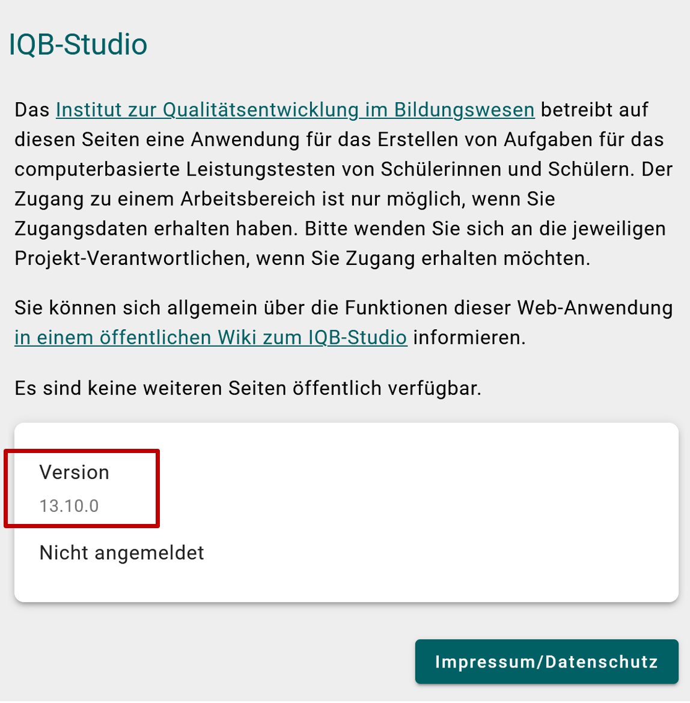

The goal of `eatPrepTBA` is to provide wrapper functions to interact with the IQB Studio and the IQB Testcenter APIs. Moreover, it provides some routines for preparing and blending data from these different resources to manage TBA studies.

```{r, include = FALSE}
# originalTestMode <- getOption("eatPrepTBA.test_mode")
# options("eatPrepTBA.test_mode" = TRUE)
# 
# knitr::opts_chunk$set(
#   collapse = TRUE, 
#   comment = "#>"
# )
```

## Preparations

```{r setup}
# install.packages("devtools")
# devtools::install_github("iqb-research/eatPrepTBA")
# library(eatPrepTBA)
```


## IQB-Studio Login

To log in to the IQB Studio, you can call the function `login_studio()`.

```{r}
#login <- login_studio(keyring = TRUE, app_version = "13.10.0")
```

This is equivalent to logging into the studio by entering your username and password on https://www.iqb-studio.de.


The `app_version` needs to be updated manually and can be found on https://www.iqb-studio.de.

```{r, out.width="70%", echo = FALSE}

```


## Login to the IQB Testcenter

To log in to the IQB Testcenter, you can call the function `create_login()`. You will be asked to provide your user name and your password (either in the console or a dialog when using RStudio). The function invisibly provides an access token, i.e., something like a key to all of your studies, that can be used on other function calls to retrieve data from the IQB Testcenter. To use this key in other functions, it should be assigned to an `R` object, e.g., `login`.

```{r create-login}
# login <- create_login()
```

For the purpose of following along this documentation, you can use the following credentials when asked:
- username: `eatPrepTBA`
- password: `eatPrepTBA`

The initial call of `create_login()` (and calling the `login` object) returns a list of workspaces that can be accessed with your credentials.

## Access a workspace

As can be seen, we have access to a workspace labelled as *eatPrepTBA Documentation* that is associated with a unique id, i.e., 134.

To access this workspace, you can either provide the label of the workspace or its id (or both -- in this case, they have to match, of course). This workspace should again be assigned to an object, i.e., `workspace`, as it carries the token generated by the `create_login()` and information about the path to find the associated files.

```{r access-workspace}
# workspace <- access_workspace(login = login, label = "eatPrepTBA Documentation")
# workspace <- access_workspace(login = login, id = 134)
```

This information can be used to access the files (i.e., testtakers, booklets, and units) and results (i.e., responses and log data).

## Retrieve files from the workspace

Using the output of `access_workspace()`, one can list (`list*()` family) the different types of files. These files can also be retrieved as `R` objects, i.e., `tibble`s (`get*()` family).

### Testtakers

These functions allow to list all testtaker files (`list_testtakers()`) and return the associated testtaker information (`get_testtakers()`), i.e., a list of all logins for potential testtakers.

```{r booklets}
# list_testtakers(workspace = workspace)
# get_testtakers(workspace = workspace)
```

### Booklets

These functions list all booklet files (`list_booklets()`) and return the associated designs (`get_booklets()`).

```{r testtakers}
# list_booklets(workspace = workspace)
# get_booklets(workspace = workspace)
```

### Units

These functions list all unit files (`list_units()`) and return the associated unit meta data (`get_units()`), i.e., the item information and the coding scheme used for scoring the responses.

```{r units}
# list_units(workspace = workspace)
# get_units(workspace = workspace)
```

```{r, include = FALSE}
# options("eatPrepTBA.test_mode" = originalTestMode)
```

