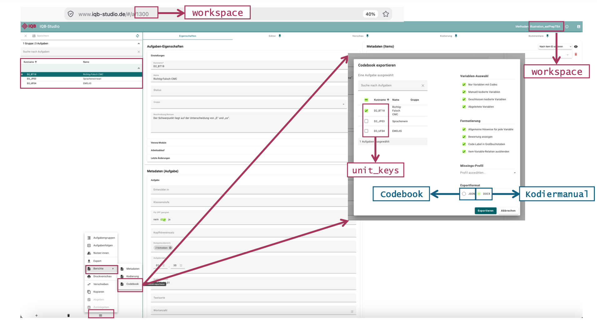
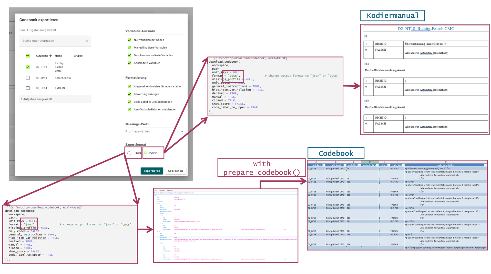
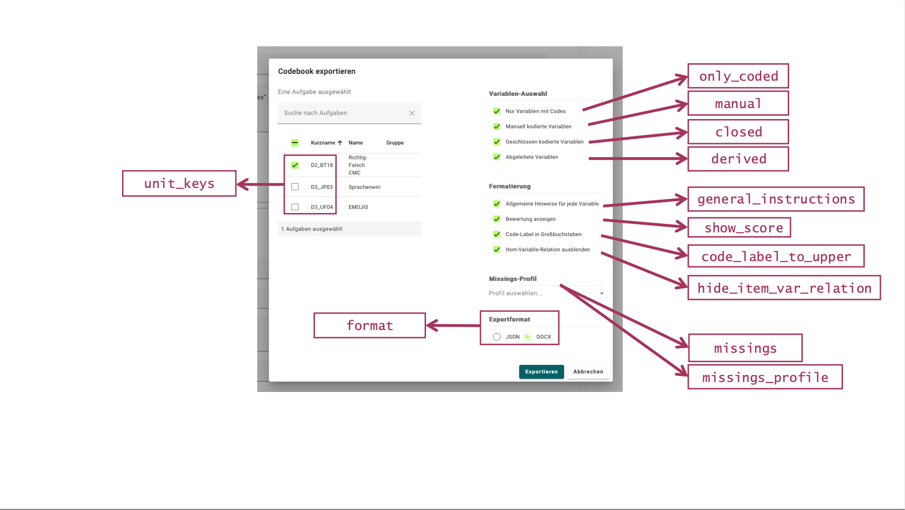
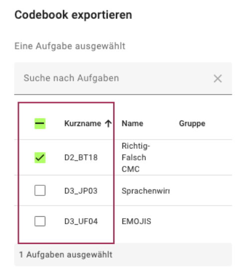
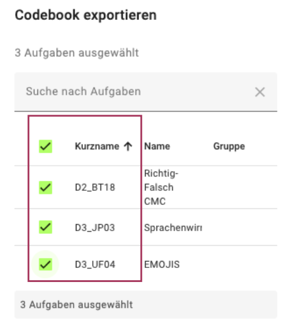
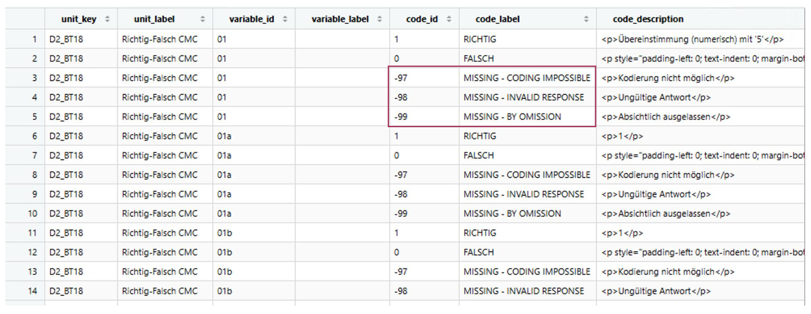

```{r, include = FALSE}
knitr::opts_chunk$set(
  collapse = TRUE,
  comment = "#>"
)
```

```{r setup}
library(eatPrepTBA)
```

## Overview

This vignette explains how to access, prepare, customize, and export codebooks from an IQB Studio workspace using `eatPrepTBA`. It also explains the difference between a codebook and a coding manual and shows how to select specific units and add missing-value codes.

## Login Procedure

To log in to the IQB Studio, use `login_studio()`. By default, credentials are entered in a dialog with masked password input when a GUI is available. Otherwise, the function uses the console. Use the same credentials as for your Studio instance, for example https://www.iqb-studio.de.

Replace `STUDIO_VERSION` with the version shown on your Studio login page. Replace the example workspace ID `1300` with an ID available to your account.

For details on login, storing credentials with `keyring`, and selecting workspaces, see the [Get Started](eatPrepTBA.html) page.


```{r eval=FALSE}

login <- login_studio(keyring = TRUE, app_version = "STUDIO_VERSION")

workspace <- access_workspace(login = login, ws_id = 1300)
```

The screenshots show an earlier Studio version; your interface may look different.

```{r, out.width="100%", echo = FALSE}
knitr::include_graphics("images/Studio_Login.png")
```

## Accessing a workspace codebook

A **codebook** provides a structured overview of the coding scheme of a workspace, including its units, variables, and corresponding codes. It can be accessed either directly in Studio or via `eatPrepTBA`.

### Accessing a codebook in IQB Studio

To access the codebook manually in Studio, open the respective workspace and navigate to:
Berichte → Codebook

```{r, out.width="100%", echo = FALSE}

```

The content of the codebook can then be customized by selecting the relevant **units**, **variables**, **formatting options**, and **output format**.

Selecting **JSON** as the output format and clicking **Exportieren** creates a machine-readable version of the codebook.


### Codebook vs. coding manual (Kodiermanual)

Studio also allows the codebook information to be exported as a DOCX coding manual (Kodiermanual). For this purpose, follow the same steps under **Berichte → Codebook**, but select **DOCX** instead of JSON as the output format.

The two documents serve different purposes:

**Codebook:** provides a structured overview of the units, variables, and corresponding codes in a workspace. It can, for example, be provided to the IEA for coding and evaluation purposes. The codebook is provided in JSON format but can be transformed into a human-readable table with `eatPrepTBA` and exported to Excel.

**Coding manual:** provides a human-readable representation of the coding information in DOCX format. It contains the unit key and unit name, the corresponding variables, and instructions on how responses should be coded (e.g., code 1 for a correct response and code 0 for an incorrect response).

Thus, the codebook and the coding manual contain related coding information but are intended for different purposes and stages of the coding process.

```{r, out.width="100%", echo = FALSE}

```

### Preparing a codebook with eatPrepTBA

The function `prepare_codebook()` can be used to retrieve and prepare the codebook of a Studio workspace directly in R.

Information on all available arguments can be displayed with:

```{r prepare-codebook-help, eval=FALSE}
?prepare_codebook
```

By default, `prepare_codebook()` retrieves coding information from all units in the selected workspace:

```{r prepare-codebook-default, eval=FALSE}
cb <- prepare_codebook(workspace)
```

The content of the codebook can be customized using additional arguments. For example, the following call explicitly specifies the default selection options:

```{r prepare-codebook, eval=FALSE}

cb <- prepare_codebook(
  workspace,
  unit_keys = NULL,
  missings = NULL,
  missings_profile = NULL,
  only_coded = FALSE,
  general_instructions = FALSE,
  hide_item_var_relation = TRUE,
  derived = TRUE,
  manual = TRUE,
  closed = TRUE,
  show_score = FALSE,
  code_label_to_upper = TRUE
)

```


Many of the arguments correspond to the selection options available under **Variablen-Auswahl** in the Studio codebook interface. They therefore allow the content of the codebook to be configured directly from R.

```{r, out.width="100%", echo = FALSE}

```

For example:

- `unit_keys` specifies which units should be included.
- `only_coded` determines whether only variables with assigned codes should be included.
- `general_instructions` requests general coding instructions from Studio. These are not retained in the table returned by `prepare_codebook()`. To include them in a coding manual, set `general_instructions = TRUE` when downloading a DOCX file with `download_codebook()`.
- `derived`, `manual`, and `closed` control which types of variables are included.
- `show_score` determines whether score information is included.
- `code_label_to_upper` controls whether code labels are converted to uppercase.
- `missings_profile` selects a missing-value profile configured in Studio by its exact name. Its codes are added to each variable in the prepared codebook.
- `missings` supplies your own missing-value codes as a tibble. You can use it on its own or to supplement and override a Studio profile, as shown below.


The resulting object `cb` contains the prepared codebook, which is automatically transformed into a tabular format and can subsequently be inspected or further processed in R.

### Selecting specific units

The `unit_keys` argument of `prepare_codebook()` can be used to restrict the codebook to specific units. By default, `unit_keys = NULL`, meaning that all units are included automatically.

```{r select-units, eval=FALSE}
cb_D2_D3 <- prepare_codebook(
  workspace,
  unit_keys = c("D2_BT18", "D3_JP03")
)
```

The Studio interface also supports selecting one or several units:

```{r, out.width="70%", echo = FALSE}


```

Alternatively, an already prepared codebook can be filtered afterwards using `dplyr::filter()`.

An individual unit can be selected using `==`:

```{r filter-single-unit, eval=FALSE}
cb %>%
  dplyr::filter(unit_key == "D2_BT18")
```


Several units can be selected using `%in%`:

```{r filter-multiple-units, eval=FALSE}
cb %>%
  dplyr::filter(unit_key %in% c("D2_BT18", "D3_JP03"))

```


### Adding missing-value codes

Missing-value codes can be added when specific response categories, such as omitted or invalid responses, should be documented alongside the regular coding categories.

#### Using a profile configured in Studio

Use `missings_profile` to select an existing Studio profile. The name must match the name shown in Studio's codebook export dialog, including upper- and lowercase letters. The following example assumes that a profile named `IQB-Standard` is configured; replace it with a profile available in your instance.

```{r prepare-codebook-profile, eval=FALSE}
cb_profile <- prepare_codebook(
  workspace,
  missings_profile = "IQB-Standard"
)
```

The function checks that the profile exists before downloading. An unknown name produces an error listing the available profile names. With the default `missings_profile = NULL`, no Studio profile is selected.

Profile codes are added to each variable in the prepared table. Studio distinguishes a missing category's identifier, such as `mci`, from its numeric code, such as `-97`. The numeric code becomes `code_id` in the table, stored as text (`"-97"`).

One profile is selected per call. If `workspace` contains several workspaces, that profile applies to all of them. To use different profiles for different workspaces, make separate calls with the corresponding workspace and profile.

#### Supplying your own missing-value codes

Define a tibble with columns `id`, `label`, and `description` and pass it via `missings`. Here, `id` contains the code value as text, for example `"-97"`. These codes are added locally to each variable in the returned table; the coding scheme and profiles stored in Studio remain unchanged.

The following example adds three missing-value codes to each variable:

```{r define-missings}
missings <- tibble::tibble(
  id = c("-97", "-98", "-99"),
  label = c(
    "MISSING - CODING IMPOSSIBLE",
    "MISSING - INVALID RESPONSE",
    "MISSING - BY OMISSION"
  ),
  description = c(
    "<p>Kodierung nicht möglich</p>",
    "<p>Ungültige Antwort</p>",
    "<p>Absichtlich ausgelassen</p>"
  )
)
```

The object can then be passed to `prepare_codebook()`:

```{r prepare-codebook-missings, eval=FALSE}
cb_withmissings <- prepare_codebook(
  workspace,
  missings = missings
)

head(cb_withmissings)
```

```{r, out.width="100%", echo = FALSE}

```

#### Combining a Studio profile with your own codes

You can supply both arguments:

```{r prepare-codebook-profile-and-missings, eval=FALSE}
cb_combined <- prepare_codebook(
  workspace,
  missings_profile = "IQB-Standard",
  missings = missings
)
```

If your tibble contains a code ID that is also in the profile, your entry replaces the profile entry, including its label and description. Other profile codes are retained, and additional codes from your tibble are appended. For example, your `id = "-97"` entry replaces the Studio entry whose numeric `code` is `-97`.

### Exporting the prepared codebook to Excel

The tabular codebook created by `prepare_codebook()` can also be exported as an Excel file for easier inspection and sharing.

This example uses the separate `writexl` package. Install it once if needed:

```{r install-writexl, eval=FALSE}
install.packages("writexl")
```

```{r export-excel, eval=FALSE}

writexl::write_xlsx(cb, "codebook.xlsx")
                    
```


### Downloading the codebook or coding manual directly with eatPrepTBA

The function `download_codebook()` can be used to export the codebook or the coding manual directly from R. 
While `prepare_codebook()` retrieves the codebook and transforms it into a tabular R object for further processing, `download_codebook()` saves the codebook or coding manual directly as a file.

Information on the available arguments can be displayed with:

```{r download-codebook-help, eval=FALSE}
?download_codebook
```

First, choose and create an output directory relative to your current working directory:

```{r set-path, eval=FALSE}
path <- file.path("output", "codebooks")
dir.create(path, recursive = TRUE, showWarnings = FALSE)
```

The `format` argument determines whether a codebook (JSON) or a coding manual (DOCX) is created.

To download the codebook in its machine-readable JSON format, use:

```{r function-download-codebook, eval=FALSE}
download_codebook(
  workspace,
  path,
  unit_keys = NULL,
  format = "json",              # change output format to "json" or "docx"
  missings_profile = NULL,
  only_coded = FALSE,
  general_instructions = TRUE,
  hide_item_var_relation = TRUE,
  derived = TRUE,
  manual = TRUE,
  closed = TRUE,
  show_score = FALSE,
  code_label_to_upper = TRUE
)
```

To download the coding manual in DOCX format, use `format = "docx"` instead:
```{r format-docx, eval=FALSE}
download_codebook(
  workspace,
  path,
  format = "docx"
)
```

To include a Studio missing-value profile in either export format, also set `missings_profile`:

```{r download-codebook-profile, eval=FALSE}
download_codebook(
  workspace,
  path,
  format = "docx",
  missings_profile = "IQB-Standard"
)
```

`download_codebook()` uses the profile stored in Studio. To add your own missing-value codes from an R tibble, use `prepare_codebook(workspace, missings = missings)` and export the resulting table instead.


## Summary
In summary, eatPrepTBA provides two ways to work with coding information from IQB Studio. Use `prepare_codebook()` if the codebook should be inspected, filtered, modified, or exported from R. Use  `download_codebook()` if the original codebook or coding manual should be downloaded directly as JSON or DOCX.
