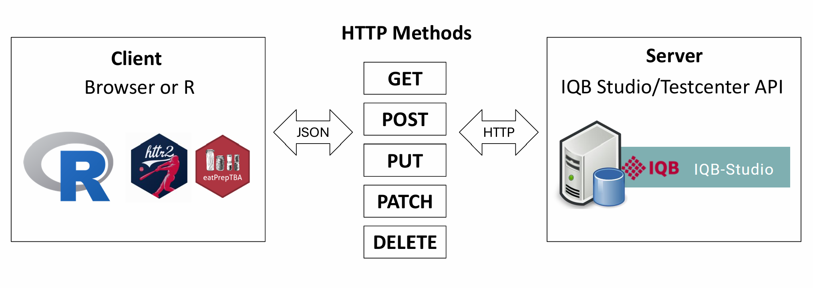
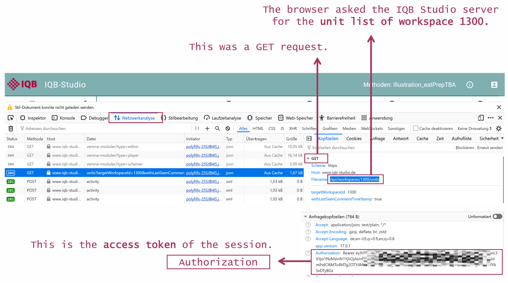
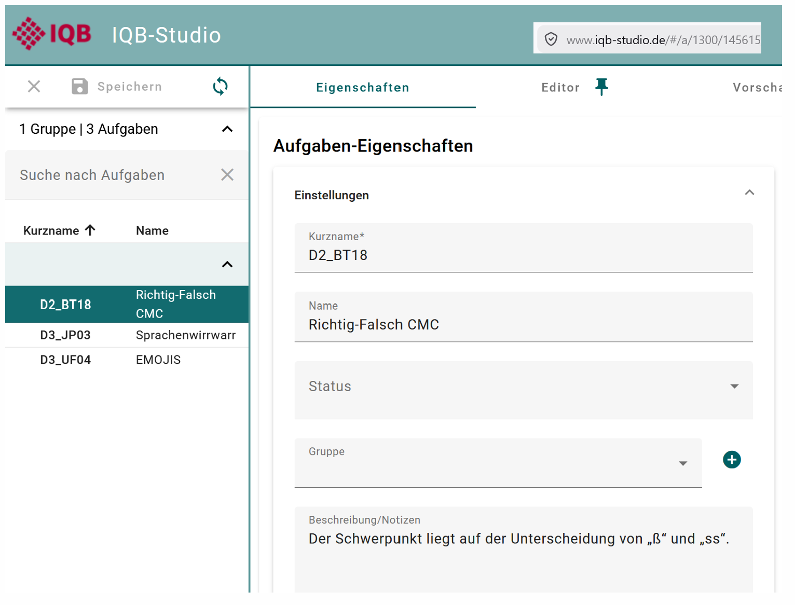
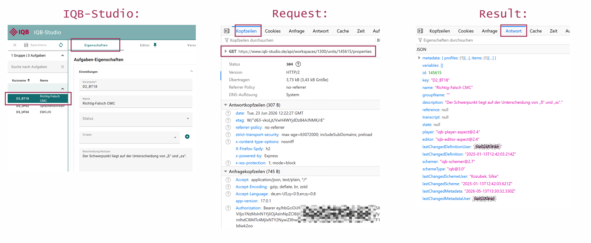
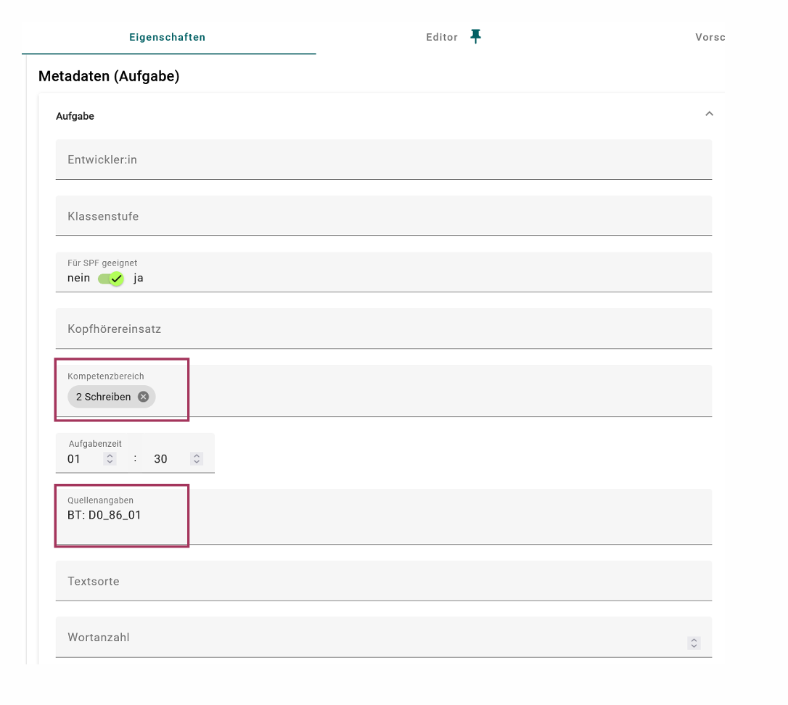
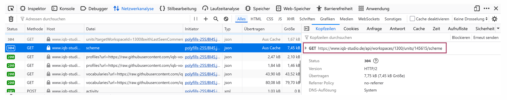
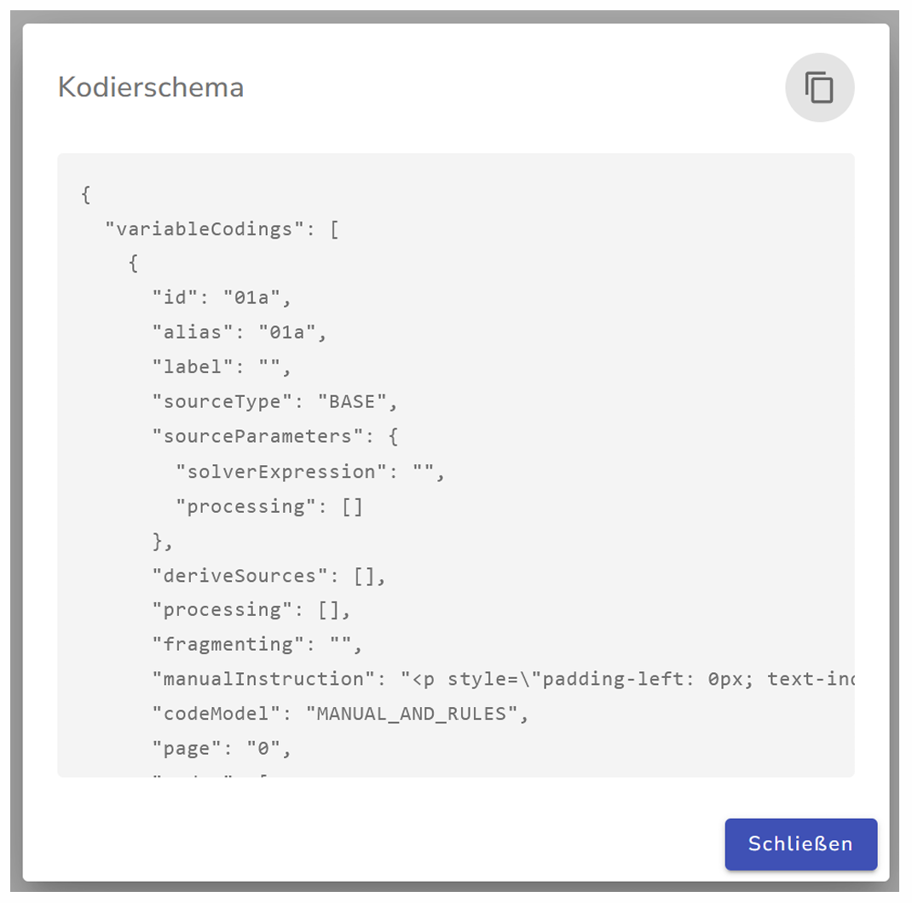
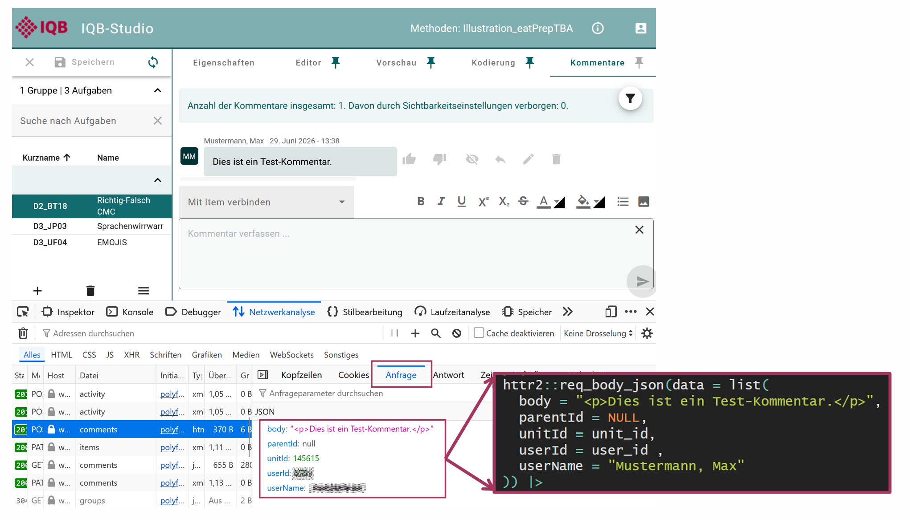
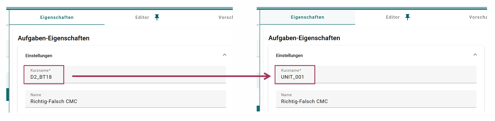

```{r, include = FALSE, message=FALSE, warning=FALSE}
knitr::opts_chunk$set(
  collapse = TRUE,
  comment = "#>"
)

library(dplyr)
```

```{css, echo=FALSE}
.side-by-side {
  display: flex;
  gap: 1.5rem;
  align-items: flex-start;
}

.side-by-side > div {
  flex: 1;
  min-width: 0;
}

.side-by-side pre {
  white-space: pre-wrap;
  word-break: break-word;
}

@media (max-width: 800px) {
  .side-by-side {
    flex-direction: column;
  }
}
```

eatPrepTBA uses HTTP requests to retrieve and modify information from IQB Studio and IQB Testcenter. These requests are sent with the R package `httr2`. eatPrepTBA wraps them in higher-level functions such as `login_studio()`, `login_testcenter()`, `access_workspace()`, `list_units()`, `get_units()`, or `prepare_codebook()` so that users do not need to write `httr2` code directly.

## HTTP requests

eatPrepTBA communicates with IQB Studio and IQB Testcenter through HTTP requests. An HTTP request is a message sent from a client to a server. In this context, the client can be the browser or R, and the server is the IQB Studio or IQB Testcenter API. The server processes the request and sends back an HTTP response.

Different types of requests are described by HTTP methods. The most relevant methods for eatPrepTBA are `GET`, `POST`, and `PATCH`.

- A `GET` request retrieves existing information from the API. For example, when eatPrepTBA retrieves the list of units in a workspace, unit properties, metadata, or a coding scheme, it sends a `GET` request. A `GET` request should not change anything on the server.

- A `POST` request sends data to the API in order to create something new. For example, posting a comment creates a new comment in the IQB Studio.

- A `PATCH` request changes something that already exists. For example, changing the short name of a unit or changing the editor version modifies an existing unit.

```{r, out.width="100%", echo=FALSE}

```

## Browser developer tools

To inspect the API requests sent by IQB Studio, open the browser developer tools. The developer tools make it possible to inspect the requests that are sent from the browser to the server.

They can usually be opened in one of the following ways:

* **Windows/Linux:** press `F12` or `Ctrl + Shift + I`
* **Mac:** press `Cmd + Option + I`
* **Any browser:** right-click anywhere on the page and select **Inspect**

After opening the developer tools, switch to the **Network** tab. In German browser interfaces this tab may be called **Netzwerkanalyse**. When an action is performed in IQB Studio, for example selecting a workspace or opening a unit, the Network tab shows the corresponding API requests. Selecting one of these requests makes it possible to inspect the request URL, method, headers, and response.

```{r, out.width="100%", echo = FALSE}

```

In the `Authorization` header, the access token used for the request appears in the form `Bearer <access-token>`. You can use it for further requests via `httr2`.

```{r eval = FALSE}
access_token <- "eyJhbGciOiJIUzI1NiI..."
```


## Access tokens

After logging in to IQB Studio (www.iqb-studio.de), the server generates an access token for the current session. This token must be sent with every subsequent request to the Studio API.

The token can be found in the browser developer tools: open the developer tools, go to the Network tab, select an API request, and inspect the request headers. In the `Authorization` header, the token appears in the form `Bearer <access-token>`.

When reproducing the request in R with `httr2`, this value is passed with `req_headers()`. In eatPrepTBA, users normally do not need to copy this token manually, because `login_studio()` handles the login and stores the token for later requests.

```{r login-studio-example, eval=FALSE}
login <- eatPrepTBA::login_studio(app_version = "17.0.1")
```


## A simple GET request with httr2

The following example shows the basic structure of a request to the IQB Studio API.
It retrieves the list of units from one workspace (in this case, workspace 1300).

```{r first-studio-request, eval=FALSE}
httr2_result <- httr2::request("https://www.iqb-studio.de/api/") %>%
  httr2::req_url_path_append("workspaces", 1300, "units") %>%
  httr2::req_url_query(
    targetWorkspaceId = 1300,
    withLastSeenCommentTimeStamp = "true"
  ) %>%
  httr2::req_headers(
    "Authorization" = paste("Bearer", access_token),
    "App-Version" = "17.0.1"
  ) %>%
  httr2::req_perform() %>%
  httr2::resp_body_json()
```

The request starts from the Studio API base URL. The path
`workspaces/{workspace_id}/units` specifies that the unit list of a specific
workspace should be retrieved.

The `Authorization` header contains the bearer token that was returned by Studio
during login. The `App-Version` header tells the API which Studio app version is used.

Because the response body is JSON, the request can be reproduced in R with `httr2` and parsed with `resp_body_json()`.

The result returned by `httr2::resp_body_json()` is an R list created from the JSON response of the Studio API. In this example, each top-level list element represents one unit in the selected workspace. Each unit contains several fields, such as the unit id, key, name, metadata, variables, timestamps, and information about comments.

```{r echo = FALSE, eval=FALSE}
# Anonymize result
httr2_result <- purrr::map(httr2_result, \(x) {
  x[grepl("User$", names(x))] <- "Max Mustermann"
  x
})
# This is used once for the creation of an example result list...
httr2_result %>% readr::write_rds("../inst/extdata/example_httr2_result.rds")
```

```{r echo = FALSE}
# ...that can be used in the vignette without needing to access the Studio
httr2_result <- readr::read_rds(system.file("extdata", "example_httr2_result.rds", package = "eatPrepTBA"))
```

:::: {.side-by-side}

::: {}

```{r first-httr2-result}
httr2_result[1]
```

:::

::: {}

```{r studio-unit-overview, out.width="100%", echo=FALSE}

```

:::

::::

eatPrepTBA transforms these nested lists into data frames or tibbles, so that the results are less nested, more consistent, and easier to use with common R workflows.

```{r echo = TRUE}
httr2_result %>%
  purrr::list_transpose() %>%
  tibble::as_tibble()
```


## Retrieving unit properties and metadata

The unit list request shown above returns overview information about the units in a workspace. However, not all information that is visible in IQB Studio is included in this response. In particular, item metadata shown in Studio under **Eigenschaften** / **Properties** has to be retrieved with a separate API request.

```{r, out.width="100%", echo = FALSE}

```

In the Network tab, the properties request appears as a `GET` request to `/api/workspaces/{workspace_id}/units/{unit_id}/properties`.

In this example, the browser requests the properties of unit `145615` in workspace `1300`. The request headers show that the request is authenticated with an `Authorization` header containing a bearer token and that the Studio app version is sent with the `app-version` header. The actual metadata returned by this request can be inspected in the **Response** / **Antwort** tab.

In `httr2`, the request can be built in the same way as the previous unit-list request, now requesting a specific unit and its `properties`:

```{r get-unit-properties, eval=FALSE}
workspace_id <- 1300
unit_id <- 145615

properties <- httr2::request("https://www.iqb-studio.de/api/") %>%
  httr2::req_url_path_append(
    "workspaces", workspace_id,
    "units", unit_id,
    "properties"
  ) %>%
  httr2::req_headers(
    "Authorization" = paste("Bearer", access_token),
    "App-Version" = "17.0.1"
  ) %>%
  httr2::req_perform() %>%
  httr2::resp_body_json()
```

```{r eval = FALSE, echo = FALSE}
# anonymize and save the properties object
properties[grepl("User$", names(properties))] <- "Max Mustermann"
readr::write_rds(properties, "../inst/extdata/example_properties.rds")
```

```{r echo = FALSE}
# load again
properties <- readr::read_rds(system.file("extdata", "example_properties.rds", package = "eatPrepTBA"))
```


The response is again parsed with `resp_body_json()`. The result is an R list created from the JSON response of the Studio API.

The metadata is stored inside the properties response. The response contains a metadata node, and inside this node there is an `items` node. The individual items contain the metadata fields that are shown in Studio under **Eigenschaften**.

A simplified structure looks like this:

```text
properties
|-- metadata
|   |-- profiles              # metadata for the unit as a whole
|   |   `-- profile
|   |       `-- entries       # unit-level metadata fields
|   `-- items                 # metadata for individual items
|       `-- item 1
|           |-- id
|           |-- variableId
|           |-- description
|           `-- profiles
|               `-- profile
|                   `-- entries   # item-level metadata fields
|-- id
|-- key
|-- name
|-- description
|-- player
|-- editor
`-- ...
```

For example, we can extract some unit-level metadata for the unit `145615` in workspace `1300`.

:::: {.side-by-side}

::: {}

```{r kompetenzbereich}
# Kompetenzbereich
properties$metadata$profiles[[1]]$entries[[1]]$label[[1]]$value
properties$metadata$profiles[[1]]$entries[[1]]$valueAsText[[1]]$value
```

```{r quellenangaben}
# Quellenangaben
properties$metadata$profiles[[1]]$entries[[5]]$label[[1]]$value
properties$metadata$profiles[[1]]$entries[[5]]$valueAsText[[1]]$value
```

:::

::: {}

```{r metadata-screenshot, out.width="100%", echo=FALSE}

```

:::

::::


## Retrieving a coding scheme

The coding scheme of a unit can also be retrieved. In the browser developer tools, the corresponding request may already appear when opening or refreshing a unit, even if the **Kodierung** tab has not been selected manually.

```{r, out.width="100%", echo = FALSE}

```

The `httr2` workflow is almost identical to the metadata request: we need the workspace id, the unit id, the access token, and the app version. Only the final part of the request path changes from `properties` to `scheme`:

```text
/api/workspaces/{workspace_id}/units/{unit_id}/scheme
```

```{r get-unit-scheme, eval=FALSE}
workspace_id <- 1300
unit_id <- 145615

scheme_response <- httr2::request("https://www.iqb-studio.de/api/") %>%
  httr2::req_url_path_append(
    "workspaces", workspace_id,
    "units", unit_id,
    "scheme"
  ) %>%
  httr2::req_headers(
    "Authorization" = paste("Bearer", access_token),
    "App-Version" = "17.0.1"
  ) %>%
  httr2::req_perform() %>%
  httr2::resp_body_json()
```

The response from the API contains the coding scheme. In some cases, the scheme is not returned as a directly nested R list. Instead, it is stored as a JSON-formatted string inside the response.

```{r eval=FALSE}
scheme_string <- scheme_response$scheme
```

```{r eval = FALSE, echo = FALSE}
# execute once locally
readr::write_file(scheme_string, "../inst/extdata/example_scheme_string.json")
```

```{r echo = FALSE}
scheme_string <- readr::read_file(system.file("extdata",
                                              "example_scheme_string.json",
                                              package = "eatPrepTBA"))
```

```{r eval = FALSE}
scheme_string
```

```{r echo = FALSE}
cat(substr(scheme_string, 1, 200), "...\n")
```

If the coding scheme should be inspected or processed as an R object, the JSON string can be parsed with `jsonlite::parse_json()`:

```{r parse-scheme}
scheme_list <- jsonlite::parse_json(scheme_string)
```

The result is then an R list. This makes it easier to inspect individual parts of the coding scheme with R.

```{r inspect-parsed-scheme}
str(scheme_list, max.level = 2)
```

The parsed list can also be converted back to JSON. When doing this, `auto_unbox = TRUE` is used so
that single values are written as JSON scalars instead of arrays of length one. This is important because the Studio API scheme format expects values such as `"id": "01a"` rather than `"id": ["01a"]`.

```{r}
scheme_json <- jsonlite::toJSON(
  scheme_list,
  auto_unbox = TRUE,
  pretty = TRUE
)
```

:::: {.side-by-side}

::: {}

```{r scheme-json-preview, echo=FALSE}
scheme_lines <- strsplit(scheme_json, "\n")[[1]]

cat(
  c(head(scheme_lines, 20), "..."),
  sep = "\n"
)
```

:::

::: {}

```{r, out.width="100%", echo=FALSE}

```

:::

::::

The JSON representation can then be written to a file:

```{r write-scheme-json, eval=FALSE}
jsonlite::write_json(
  scheme_list,
  "scheme.json",
  auto_unbox = TRUE,
  pretty = TRUE
)
```

In summary, not every response is immediately available as a conveniently nested R object. Sometimes the API returns JSON inside a string. In those cases, eatPrepTBA parses the string before the coding scheme can be handled like a regular R list.


## Creating new data with POST requests

The previous examples used `GET` requests to retrieve information from the Studio API. For a `POST` request, we set `httr2::req_method("POST")`.

A `POST` request sends data to the server in order to create something new. One example is posting a new comment to a unit.

```text
/api/workspaces/{workspace_id}/units/{unit_id}/comments
```

In addition to the request path and headers, the request needs a body. This body is also called a payload. In German browser interfaces, it may be shown as **Anfrage**. The body contains the data that should be sent to the API. In this example, `body` contains the text of the comment. `parentId` is used when replying to an existing comment; for a new top-level comment, it can be `NULL`.

```{r, out.width="100%", echo=FALSE}

```

In addition to the `access_token`, this manual example also needs the user id that Studio sends when posting comments. It can be inspected in the Payload tab of the corresponding browser request.

```{r, eval=FALSE}
user_id <- 12345
```

The full request looks like this:

```{r post-comment, eval=FALSE}
workspace_id <- 1300
unit_id <- 145615

httr2::request("https://www.iqb-studio.de/api/") %>%
  httr2::req_method("POST") %>%
  httr2::req_url_path_append(
    "workspaces", workspace_id,
    "units", unit_id,
    "comments"
  ) %>%
  httr2::req_headers(
    "Authorization" = paste("Bearer", access_token),
    "App-Version" = "17.0.1"
  ) %>%
  httr2::req_body_json(data = list(
    body = "<p>Dies ist ein Test-Kommentar.</p>",
    parentId = NULL,
    unitId = unit_id,
    userId = user_id,
    userName = "Mustermann, Max"
  )) %>%
  httr2::req_perform()
```

In eatPrepTBA, users should usually not construct this request body manually. The package can use information from the Studio login, for example the logged-in user name, so that comments are not posted under a manually entered user name.


## Changing existing data with PATCH requests

For a `PATCH` request, we set `httr2::req_method("PATCH")`. A `PATCH` request is used to change something that already exists. For example, changing the short name of a unit modifies the existing unit properties:

```text
/api/workspaces/{workspace_id}/units/{unit_id}/properties
```

The request body contains the fields that should be updated.

```{r patch-unit-properties, eval=FALSE}
workspace_id <- 1300
unit_id <- 145615

httr2::request("https://www.iqb-studio.de/api/") %>%
  httr2::req_method("PATCH") %>%
  httr2::req_url_path_append(
    "workspaces", workspace_id,
    "units", unit_id,
    "properties"
  ) %>%
  httr2::req_headers(
    "Authorization" = paste("Bearer", access_token),
    "App-Version" = "17.0.1"
  ) %>%
  httr2::req_body_json(data = list(
    id = unit_id,
    key = "UNIT_001"
  )) %>%
  httr2::req_perform()
```

```{r, out.width="100%", echo=FALSE}

```
